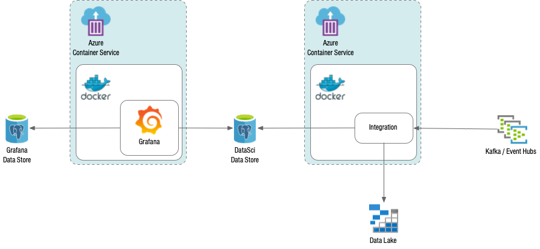

# Grafana Terraform Cluster
Provisions a set of containers and services to support integration with the datasci pipeline. 



## Usage
This module is designed as a part of the datasci pipeline.  However, it can be stood up independently 
and configured to use any set of EventHub topics.

```
module "grafana" {
  source               = "github.com/chesapeaketechnology/terraform-datasci-grafana-cluster"
  location             = azurerm_resource_group.datasci_group.location
  resource_group_name  = azurerm_resource_group.datasci_group.name
  cluster_name         = var.cluster_name
  virtual_network_name = azurerm_virtual_network.datasci_net.name
  environment          = var.environment
  default_tags         = var.default_tags
  grafana_admin_user   = var.grafana_admin_user
  network_profile_id   = azurerm_network_profile.datasci_net_profile.id
  subnet_start_address = "10.0.1.0"
  subnet_end_address   = "10.0.1.255"
  topics             = toset(var.mqtt_topics)
  eventhub_keys = module.mqtt_eventhubs.topic_primary_key
  eventhub_namespace = module.mqtt_eventhubs.namespace_fqn
  eventhub_shared_access_policies = module.mqtt_eventhubs.topic_shared_access_policy_name
}
```

## Changelog

##### [0.2.0]() - 2020-08-17
 * Integrated into the datasci pipeline
 
##### [0.1.1]() - 2020-08-11
 * Added data integration components
 * Added support for multiple topic consumers.

##### [0.1.0]() - 2020-08-03
 * Initial release of cluster

## Contact
* **Les Stroud** - [lstroud](https://github.com/lstroud)  